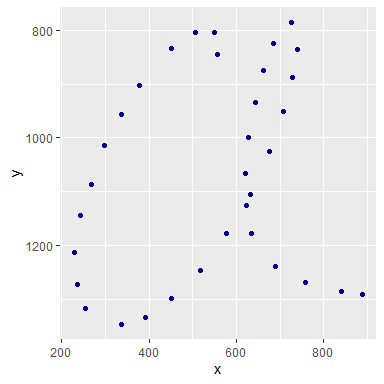
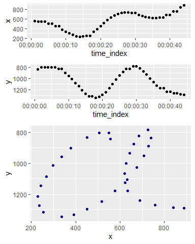

Initial workarounds
================
eNVy
Original: 2021-04-04, Updated 2021-04-09

To do:

-   Text files are unreadable directly
    -   Ignore first lines
    -   then set table to df  
    -   add time column

Data sources and info:

-   UCI Alpha Numerics: Tamil letters  
-   FKI : Handwriting, sentences.  
-   **UCI Alphabet: Alphabatic letters**
    -   \[url\]\[<https://archive.ics.uci.edu/ml/machine-learning-databases/uji-penchars>\]  
    -   The dataset is unreadable through readlines (without structural
        format)
    -   Use RE

UCI Example:

``` r
x = c(557,
      550,550,550,505,505,450,450,377,336,298,268,242,230,235,254,254,337,392,452,518,577,632,676,707,728,739,739,727,727,684,661,643,628,621,622,635,635,689,689,759,759,841,
        888)

y = c( 844, 
       803, 803, 803, 803, 803, 833, 833, 903, 957,1014,1086,1144,1214,1272,1317,1317,1347,1334,1298,1247,1178,1105,1026, 951, 888, 835, 835, 785, 785, 824, 875, 935,1000,1066,1126,1177,1177,1239,1239,1269,1269,1285,
        1291)

df = data.frame(x = x, y = y) 

gplt <- df %>% 
  ggplot(aes(x = x, y = y)) + 
  geom_point(col = "darkblue") + 
  scale_y_reverse()
gplt
```

<!-- -->

``` r
df %<>% 
  rownames_to_column(var = "time_index")

df %>% head()
```

    ##   time_index   x   y
    ## 1          1 557 844
    ## 2          2 550 803
    ## 3          3 550 803
    ## 4          4 550 803
    ## 5          5 505 803
    ## 6          6 505 803

``` r
time_x <- df %>%
  ggplot(aes(x = time_index, y = x)) +
  scale_x_time() +
  geom_point()

time_y <- df %>% 
  ggplot(aes(x = time_index, y = y)) + 
  scale_x_time() + 
  scale_y_reverse() + 
  geom_point()


list = rbind(c(1,1),
         c(2,2),
         c(3,3),
         c(3,3))

grobs = list(time_x, time_y, gplt)

gridExtra::grid.arrange(grobs = grobs, 
                        layout_matrix = list)
```

<!-- -->
