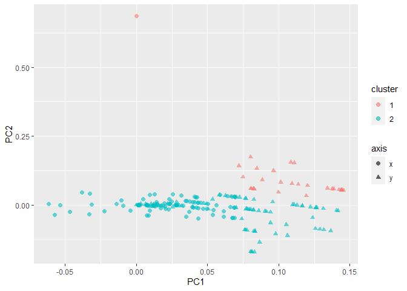

PCA-cluster
================
eNVy
6/17/2021

``` r
knitr::opts_chunk$set(echo = TRUE)
knitr::opts_knit$set(root.dir = "./")
here::i_am("Code/pca.rmd")
```

    ## here() starts at E:/Academic/Continuous Learning/R/sinahalaRecog

``` r
library(here)
```

    ## Warning: package 'here' was built under R version 4.0.4

``` r
here()
```

    ## [1] "E:/Academic/Continuous Learning/R/sinahalaRecog"

``` r
library(tidyverse)
library(tidymodels)
```

Source the full function to read the df

``` r
source(here("Code/generateInterpolatedDF.R"))
```

``` r
df_raw <- read_csv(here("Data/UCI_handWritten/data.csv"))

df_raw %>% head()
```

    ## # A tibble: 6 x 5
    ##   char    key person attempt_one                   attempt_two                  
    ##   <chr> <dbl> <chr>  <chr>                         <chr>                        
    ## 1 a         1 W01    557 844 550 803 550 803 550 ~ 614 743 614 743 614 743 572 ~
    ## 2 b         8 W01    442 523 442 512 442 512 443 ~ 486 508 481 487 485 469 485 ~
    ## 3 c        15 W01    723 1009 727 995 727 995 703~ 547 851 565 834 570 822 565 ~
    ## 4 d        22 W01    436 1062 433 1046 420 1046 4~ 465 899 432 912 387 939 334 ~
    ## 5 e        29 W01    482 1129 482 1129 482 1129 4~ 386 1074 370 1085 370 1085 3~
    ## 6 f        36 W01    306 1195 300 1209 295 1224 2~ 431 1102 419 1114 407 1124 4~

``` r
df <- mostLameFuncEver(df = df_raw, n_int = 100) %>% 
  secondMostLameFuncEver()
df %>% head()
```

    ## # A tibble: 6 x 202
    ##   char    key  x1_1   x1_2  x1_3  x1_4   x1_5    x1_6    x1_7   x1_8   x1_9
    ##   <chr> <dbl> <dbl>  <dbl> <dbl> <dbl>  <dbl>   <dbl>   <dbl>  <dbl>  <dbl>
    ## 1 a         1     0 -3.04  -6.08 -7     -7     -7      -7      -8.82 -28.4 
    ## 2 b         8     0  0      0     0      0      0.172   0.606   1.12   2.42
    ## 3 c        15     0  0.848  1.70  2.55   3.39   4       4       4      4   
    ## 4 d        22     0 -1.36  -2.73 -7.73 -13.6  -20.6   -28.4   -37.2  -47.6 
    ## 5 e        29     0  0      0     0      0      0      -1.09   -4.27  -7.45
    ## 6 f        36     0 -2.85  -5.70 -8.12 -10.5  -11     -11      -4.86   4.16
    ## # ... with 191 more variables: x1_10 <dbl>, x1_11 <dbl>, x1_12 <dbl>,
    ## #   x1_13 <dbl>, x1_14 <dbl>, x1_15 <dbl>, x1_16 <dbl>, x1_17 <dbl>,
    ## #   x1_18 <dbl>, x1_19 <dbl>, x1_20 <dbl>, x1_21 <dbl>, x1_22 <dbl>,
    ## #   x1_23 <dbl>, x1_24 <dbl>, x1_25 <dbl>, x1_26 <dbl>, x1_27 <dbl>,
    ## #   x1_28 <dbl>, x1_29 <dbl>, x1_30 <dbl>, x1_31 <dbl>, x1_32 <dbl>,
    ## #   x1_33 <dbl>, x1_34 <dbl>, x1_35 <dbl>, x1_36 <dbl>, x1_37 <dbl>,
    ## #   x1_38 <dbl>, x1_39 <dbl>, x1_40 <dbl>, x1_41 <dbl>, x1_42 <dbl>,
    ## #   x1_43 <dbl>, x1_44 <dbl>, x1_45 <dbl>, x1_46 <dbl>, x1_47 <dbl>,
    ## #   x1_48 <dbl>, x1_49 <dbl>, x1_50 <dbl>, x1_51 <dbl>, x1_52 <dbl>,
    ## #   x1_53 <dbl>, x1_54 <dbl>, x1_55 <dbl>, x1_56 <dbl>, x1_57 <dbl>,
    ## #   x1_58 <dbl>, x1_59 <dbl>, x1_60 <dbl>, x1_61 <dbl>, x1_62 <dbl>,
    ## #   x1_63 <dbl>, x1_64 <dbl>, x1_65 <dbl>, x1_66 <dbl>, x1_67 <dbl>,
    ## #   x1_68 <dbl>, x1_69 <dbl>, x1_70 <dbl>, x1_71 <dbl>, x1_72 <dbl>,
    ## #   x1_73 <dbl>, x1_74 <dbl>, x1_75 <dbl>, x1_76 <dbl>, x1_77 <dbl>,
    ## #   x1_78 <dbl>, x1_79 <dbl>, x1_80 <dbl>, x1_81 <dbl>, x1_82 <dbl>,
    ## #   x1_83 <dbl>, x1_84 <dbl>, x1_85 <dbl>, x1_86 <dbl>, x1_87 <dbl>,
    ## #   x1_88 <dbl>, x1_89 <dbl>, x1_90 <dbl>, x1_91 <dbl>, x1_92 <dbl>,
    ## #   x1_93 <dbl>, x1_94 <dbl>, x1_95 <dbl>, x1_96 <dbl>, x1_97 <dbl>,
    ## #   x1_98 <dbl>, x1_99 <dbl>, x1_100 <dbl>, y1_1 <dbl>, y1_2 <dbl>, y1_3 <dbl>,
    ## #   y1_4 <dbl>, y1_5 <dbl>, y1_6 <dbl>, y1_7 <dbl>, y1_8 <dbl>, y1_9 <dbl>, ...

# PCA

``` r
df %>% 
  select(-all_of(c("char", "key"))) %>% .[c(1:2), ] %>% 
  prcomp() -> pca
```

# Cluster

``` r
df_pca <- pca$rotation
df_pca %>% 
  kmeans(centers = 2) -> kmeans
```

# Visualize

``` r
require(ggfortify)
```

    ## Loading required package: ggfortify

``` r
df_pca %>% 
  bind_cols(cluster = kmeans$cluster, 
            axis = rownames(df_pca)) %>% 
  mutate(
    axis = str_detect(axis, "x"), 
    axis = case_when(axis ~ "x", !axis ~ "y"), 
    cluster = as.factor(cluster)
  ) %>% 
  ggplot() + 
  geom_point(aes(PC1, PC2, color = cluster, # color by the cluster
                 shape = axis),  # shape by the coordinate x or y
             alpha = 0.6, size = 2)
```

<!-- -->

Conclusion:

Clustered PCA components are not seperated according to coordinate (x/y)
